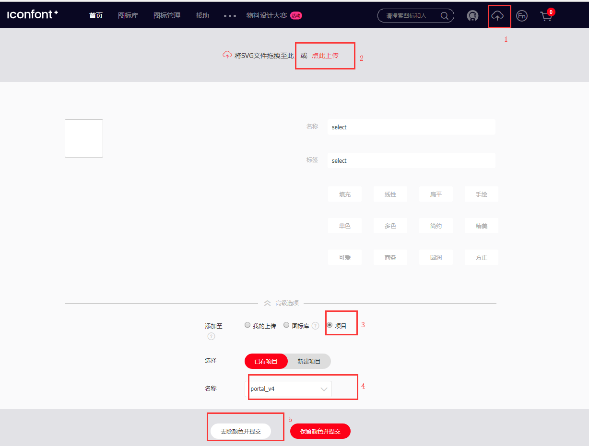

    <h1>IconFont 图标</h1>
    <ul class="icon_lists clear">            
        <li>
            <i class="icon iconfont icon-pass"></i>
            
pass

            
.icon-pass

        </li>
        <li>
            <i class="icon iconfont icon-person"></i>
            
person

            
.icon-person

        </li>
        <li>
            <i class="icon iconfont icon-setting"></i>
            
setting

            
.icon-setting

        </li>
        <li>
            <i class="icon iconfont icon-phone"></i>
            
phone

            
.icon-phone

        </li>
        <li>
            <i class="icon iconfont icon-password"></i>
            
password

            
.icon-password

        </li>
        <li>
            <i class="icon iconfont icon-profit"></i>
            
profit

            
.icon-profit

        </li>
        <li>
            <i class="icon iconfont icon-user"></i>
            
user

            
.icon-user

        </li>
        <li>
            <i class="icon iconfont icon-backtop"></i>
            
backtop

            
.icon-backtop

        </li>
        <li>
            <i class="icon iconfont icon-userinfo"></i>
            
userinfo

            
.icon-userinfo

        </li>
        <li>
            <i class="icon iconfont icon-close"></i>
            
close

            
.icon-close

        </li>
        <li>
            <i class="icon iconfont icon-call"></i>
            
call

            
.icon-call

        </li>
        <li>
            <i class="icon iconfont icon-code"></i>
            
code

            
.icon-code

        </li>
        <li>
            <i class="icon iconfont icon-contact"></i>
            
contact

            
.icon-contact

        </li>
        <li>
            <i class="icon iconfont icon-email"></i>
            
email

            
.icon-email

        </li>
        <li>
            <i class="icon iconfont icon-down"></i>
            
down

            
.icon-down

        </li>
        <li>
            <i class="icon iconfont icon-joinus"></i>
            
joinus

            
.icon-joinus

        </li>
        <li>
            <i class="icon iconfont icon-feedback"></i>
            
feedback

            
.icon-feedback

        </li>
        <li>
            <i class="icon iconfont icon-logout"></i>
            
logout

            
.icon-logout

        </li>
        <li>
            <i class="icon iconfont icon-lineup"></i>
            
lineup

            
.icon-lineup

        </li>
        <li>
            <i class="icon iconfont icon-message"></i>
            
message

            
.icon-message

        </li>
        <li>
            <i class="icon iconfont icon-take-up"></i>
            
箭头_列表收起_o

            
.icon-take-up

        </li>
        <li>
            <i class="icon iconfont icon-take-down"></i>
            
箭头_列表展开_o

            
.icon-take-down

        </li>
        <li>
            <i class="icon iconfont icon-right-arrow"></i>
            
合作伙伴-6

            
.icon-right-arrow

        </li>
        <li>
            <i class="icon iconfont icon-advantage-two"></i>
            
合作伙伴-成本优势

            
.icon-advantage-two

        </li>
        <li>
            <i class="icon iconfont icon-process-one"></i>
            
合作伙伴-1

            
.icon-process-one

        </li>
        <li>
            <i class="icon iconfont icon-process-two"></i>
            
合作伙伴-2

            
.icon-process-two

        </li>
        <li>
            <i class="icon iconfont icon-process-three"></i>
            
合作伙伴-3

            
.icon-process-three

        </li>
        <li>
            <i class="icon iconfont icon-process-four"></i>
            
合作伙伴-4

            
.icon-process-four

        </li>
        <li>
            <i class="icon iconfont icon-advantage-four"></i>
            
合作伙伴-技术支持

            
.icon-advantage-four

        </li>
        <li>
            <i class="icon iconfont icon-grade"></i>
            
合作伙伴-皇冠

            
.icon-grade

        </li>
        <li>
            <i class="icon iconfont icon-advantage-three"></i>
            
合作伙伴-联盟权益

            
.icon-advantage-three

        </li>
        <li>
            <i class="icon iconfont icon-advantage-one"></i>
            
合作伙伴-市场资源

            
.icon-advantage-one

        </li>
    </ul>
    <h2 id="font-class-">font-class引用</h2>
    

    
font-class是unicode使用方式的一种变种，主要是解决unicode书写不直观，语意不明确的问题。

    
与unicode使用方式相比，具有如下特点：

    <ul>
    <li>兼容性良好，支持ie8+，及所有现代浏览器。</li>
    <li>相比于unicode语意明确，书写更直观。可以很容易分辨这个icon是什么。</li>
    <li>因为使用class来定义图标，所以当要替换图标时，只需要修改class里面的unicode引用。</li>
    <li>不过因为本质上还是使用的字体，所以多色图标还是不支持的。</li>
    </ul>
    
使用步骤如下：

    <h3 id="-fontclass-">第一步：引入项目下面生成的fontclass代码：</h3>
    <pre><code class="lang-js hljs javascript">&lt;link rel="stylesheet" type="text/css" href="./iconfont.css"&gt;</code></pre>
    <h3 id="-">第二步：挑选相应图标并获取类名，应用于页面：</h3>
    <pre><code class="lang-css hljs">&lt;i class="iconfont icon-xxx"&gt;&lt;/i&gt;</code></pre>
    <blockquote>
    
"iconfont"是你项目下的font-family。可以通过编辑项目查看，默认是"iconfont"。

    </blockquote>
    <h2 id="font-class-">添加图标方法</h2>
    <h3 id="-fontclass-">第一步：加入项目：</h3>
    该图标为阿里图标库，需登录http://www.iconfont.cn/，并把昵称告知高宇，等待他加入项目后，可以在该网站的图标库中查看，即可以上传
    <h3 id="-fontclass-">第二步：上传svg图标：</h3>
    
    

